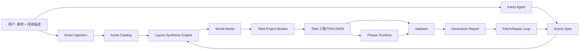

# 02 系统架构

## 宏观架构

## 模块划分

### 1. Asset Ingestion
职责：
- 解析用户上传的图片、图集、Aseprite 导出
- 生成素材清单
- 标注哪些资源可平铺、可旋转、可碰撞、可作为对象摆放
- 生成缩略图与语义标签

输入：
- 原始图片 / 图集 / 元数据

输出：
- `asset-manifest.json`
- `asset-tags.json`
- 缩略图和切片结果

### 2. Intent Agent
职责：
- 将自然语言描述转成结构化 Scene Spec
- 判断用户想要的主题、地形、主路径、区域、对象、天气、相机需求

输入：
- 用户描述
- asset catalog

输出：
- `scene-spec.json`

### 3. Layout Synthesis Engine
职责：
- 不是画图，而是“求布局”
- 把 Scene Spec 转为道路骨架、区域分配、对象放置和导航网格

输入：
- Scene Spec
- Asset Catalog
- 地图约束

输出：
- `layout-plan.json`
- 中间 `world-model.json`（可选）

### 4. Tiled Project Builder
职责：
- 把布局结果落到 tile layers / object layers / custom properties
- 写出 TMX / 导出 JSON
- 生成适合人工接管的工程结构

### 5. Phaser Runtime
职责：
- 加载 Tiled JSON
- 创建图层、碰撞、角色、触发器、天气系统和相机

### 6. Validator / Critic
职责：
- 校验可达性、碰撞合理性、对象密度、与用户描述的一致性
- 输出错误、警告、评分、修复建议

## 数据流

### 用户请求阶段
1. 用户上传素材和文本描述
2. 素材分析器生成 manifest
3. Intent Agent 读取 manifest 并生成 Scene Spec

### 构建阶段
1. Layout Engine 生成路径与区域
2. Map Builder 映射到 Tiled 图层与对象层
3. 导出 JSON 给 Runtime 使用

### 验收阶段
1. Runtime 生成预览
2. Validator 检查路径、碰撞、视觉密度、天气遮挡
3. 输出 generation report

### 迭代阶段
1. 用户发出变更请求
2. 系统生成 change request
3. 仅对 scene spec 与布局计划做增量调整
4. 生成 patch 而不是整图重建

## 强约束

- Scene Spec 是所有上游 agent 与下游 builder 的唯一主协议
- Runtime 不能依赖任意命名 object property
- Tiled 层命名必须固定
- Weather 系统只消费 weather preset schema
