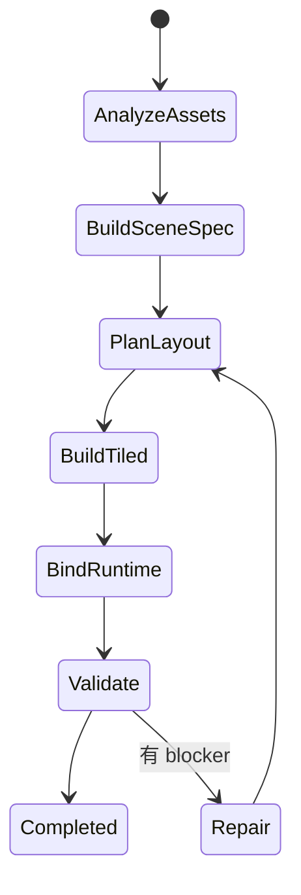

# 03 Agent 协议设计

## Agent 列表

### 1. Asset Reasoning Agent
职责：
- 理解素材“能干什么”
- 不能只识别图像，还要归纳 affordance（可放置方式、碰撞、类别、变体）

输入：
- 用户素材
- 已知切片信息
- 命名、目录和可选标签

输出：
- `asset-manifest.json` 的候选版本
- 缺失信息列表（例如“无法确定道路 tile 是否可自动衔接”）

### 2. Intent Agent
职责：
- 将自然语言需求翻译成 Scene Spec
- 补全未显式说明但必要的默认值

输入：
- 用户描述
- asset manifest
- 预设模板（例如 park / town / plaza）

输出：
- `scene-spec.json`

### 3. Layout Agent
职责：
- 根据 Scene Spec 推导布局
- 输出的是道路骨架、区域划分、对象布置计划，而不是最终 tile data

输入：
- scene spec
- asset manifest

输出：
- `layout-plan.json`

### 4. Builder Agent
职责：
- 读取布局计划并生成 Tiled 结构
- 应支持多次局部重建

输出：
- map layers
- object layers
- Tiled custom properties

### 5. Critic Agent
职责：
- 按规则与用户目标检查结果
- 输出 warnings / blockers / suggested fixes

## 统一消息格式

建议所有 agent 都使用：

```json
{
  "jobId": "job_001",
  "stage": "intent",
  "inputRef": ["asset-manifest.json", "user-request.md"],
  "outputRef": ["scene-spec.json"],
  "status": "completed",
  "metrics": {
    "confidence": 0.84
  },
  "warnings": []
}
```

## Scene Change Request 协议

后续迭代不再重复传完整描述，而是传变更意图。

```json
{
  "changeId": "chg_001",
  "targetSceneId": "scene_park_001",
  "operations": [
    {
      "op": "move-zone",
      "zoneId": "cafe_zone",
      "to": "top_right"
    },
    {
      "op": "set-weather",
      "weather": {
        "type": "rain",
        "intensity": 0.2
      }
    },
    {
      "op": "adjust-object-count",
      "kind": "bench",
      "delta": -2
    }
  ]
}
```

## 编排器建议状态机



## Agent 输出约束

- 任何输出都必须能用 JSON Schema 校验
- 任何默认值都要显式落入产物
- 任何不确定项都要落成 warning
- 任何被忽略的用户要求都要列入 `unresolvedRequests`

## 建议的失败恢复策略

### 素材语义不清
- 优先降级为 object placement
- 记录 warning
- 提示人工补标签

### 道路无法自动铺设
- 降级为最小连通路径
- 放弃高级 decorative edge

### 天气资源缺失
- 用 runtime 粒子替代，而不是阻断生成

### 角色出生点不可达
- 自动修复出生点到最近 walkable tile
